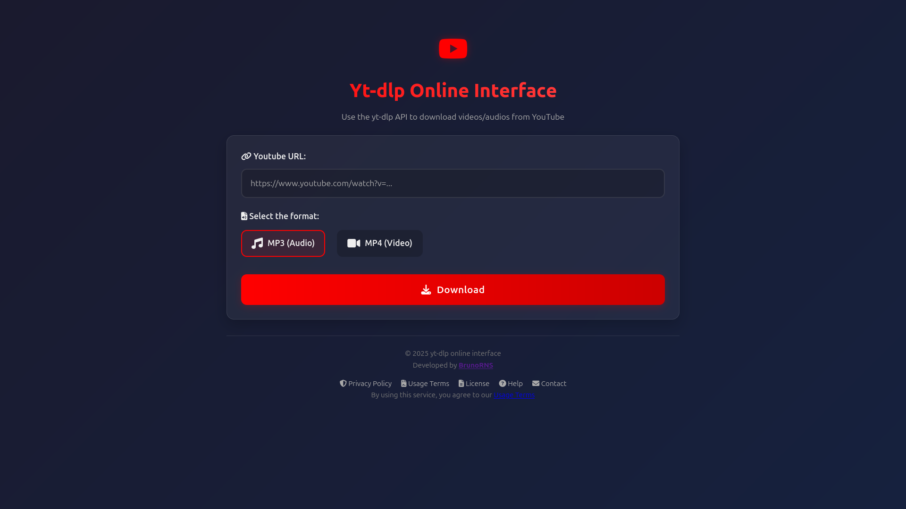

# YT-DLP Online Interface

A simple web interface to run yt-dlp online and easily manipulate YouTube videos as MP3 (audio) or MP4 (video) files.

## How to Use

1. **Access the application**:
   - If running locally: `http://localhost:8080`
   - Online version: [https://onlineytdlp.onrender.com/](https://onlineytdlp.onrender.com/)

2. **Paste the YouTube link**:
   - Example: `https://www.youtube.com/watch?v=...`

3. **Choose the format**:
   - MP3 for music/podcasts
   - MP4 for videos

4. **Click "Download"**:
   - Wait a few seconds
   - The file will be downloaded automatically

## Features

- Direct conversion to high-quality MP3
- Download high-resolution videos
- Video preview before downloading
- Clean and easy-to-use interface

> **Legal Notice**:  
> Use only for content you have permission to download. Respect the [YouTube Terms of Service](https://www.youtube.com/t/terms).

## For Developers

[See the technical documentation](DOCS.md)

## License

This software is licensed under the GNU General Public License v3.0 (GPL v3) and its terms of use and privacy can be found in [AGREEMENTS.md](AGREEMENTS.md) and [PRIVACY.md](PRIVACY.md). By using this software, you agree to the terms of use and privacy described in this file.
