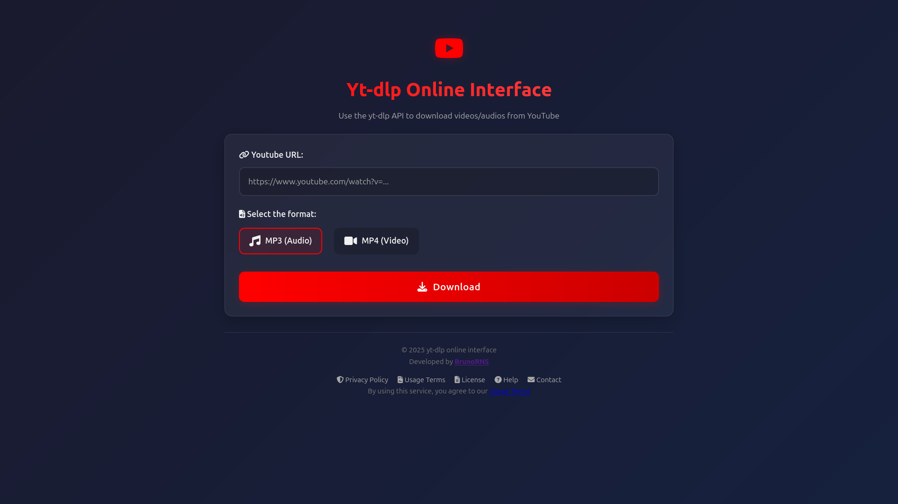

# YT-DLP Online Interface

A simple web interface to run **yt-dlp** online and easily convert YouTube videos to MP3 (audio) or MP4 (video) files. Built with Spring Boot and a standalone Python backend.  
It also offers a **desktop application** for Windows (64/32‑bit) and Linux (64‑bit).



## Quick Start – Using the Hosted Version

1. Open [https://onlineytdlp.onrender.com/](https://onlineytdlp.onrender.com/)
2. Paste a YouTube link (e.g. `https://www.youtube.com/watch?v=...`)
3. Choose **MP3** for audio or **MP4** for video
4. Click **Download** – the file will be prepared and downloaded automatically

> **Note:** The service runs on a free tier and may spin down after inactivity. First request after idle can take a few seconds.

## Features

- Convert YouTube videos to high‑quality MP3 (audio extraction)
- Download MP4 videos at the best available resolution
- Preview video thumbnail and title before downloading
- Clean, responsive interface – works on mobile and desktop
- Python backend bundled as a single, standalone executable
- **Desktop app** available (jpackage or GraalVM native image) for Windows (64/32‑bit) and Linux (64‑bit).

## Running Locally

### Prerequisites

- **Java 17** (or newer, Temurin recommended)
- **GraalVM SDK** (optional, only needed if you want to build native images)
- **Python 3.12+** (only required to rebuild the Python executable)
- **UPX** (recommended on Linux for compressing the Python binary; on Debian/Ubuntu: `sudo apt install upx-ucl`)
- **Maven Wrapper** included (`./mvnw`)

### Download Pre‑built Binaries

Pre‑compiled binaries for the web app and desktop are available on the [Releases](https://github.com/your-repo/releases) page.  

- **Web app:** `java -jar videodownloader-2.0.0.jar` → opens at `http://localhost:8080`
- **Desktop:** extract the platform‑specific archive and run the launcher.

### Building from Source

The project uses a **Makefile** to orchestrate builds. To see all available targets:

```bash
make help
```

#### Common Build Commands

| Command                        | Description                                                                 |
|--------------------------------|-----------------------------------------------------------------------------|
| `make test`                    | Run Java and Python unit tests                                              |
| `make build`                   | Compile Maven JAR only (web profile)                                        |
| `make build-python`            | Build standalone Python executable (Nuitka + optional FFmpeg)               |
| `make build-web`               | JAR + Python → ready‑to‑run web app                                         |
| `make build-web-graal`         | Web app as a GraalVM native image (faster startup)                          |
| `make build-package`           | Desktop installer (jpackage) – platform dependent                           |
| `make build-graal`             | Desktop app as GraalVM native image                                         |
| `make update-docker`           | Copy JAR, GraalVM and Python into `docker/` folder                          |
| `make update-docker-no-graal`  | Copy only JAR and Python into `docker/` (no GraalVM)                        |
| `make clean`                   | Remove all generated files                                                  |

#### Environment Variables

- **`BUNDLE_FFMPEG`** – Set to `0` to exclude FFmpeg from the Python executable.  
  The binary will then require `ffmpeg` installed on the target system.  
  *Useful for reducing binary size (Linux typical: ~50 MB without FFmpeg).*

- **`MVN_EXTRA_PROFILES`** – Comma‑separated extra Maven profiles, e.g. `,win-x86` for Windows 32‑bit builds (disables JavaFX and uses the Swing panel).

Examples:

```bash
# Build desktop app for Windows 32‑bit (no JavaFX, Swing‑based UI)
make build-package JP_TARGET=win MVN_EXTRA_PROFILES=,win-x86

# Build web app without embedded FFmpeg
make build-web BUNDLE_FFMPEG=0
```

#### Desktop Build Notes

- **64‑bit platforms** (Windows x64, Linux x64): the desktop app uses **JavaFX** and the embedded `WebViewPanel`. The Maven profiles `platform-linux`, `platform-windows` or `platform-mac` are activated automatically.
- **Windows 32‑bit**: JavaFX is not available. The build automatically uses a pure **Swing** interface (`SwingDownloadPanel`) that mimics the web look & feel. The Maven profile `win-x86` excludes `WebViewPanel.java` and drops JavaFX dependencies.

## Project Structure

```sh
├── src/
│   ├── main/
│   │   ├── java/            # Spring Boot web application
│   │   └── python/          # yt-dlp wrapper script
│   └── test/                # Unit tests (Java + Python)
├── scripts/                 # FFmpeg downloader
├── docker/                  # Docker build context
├── build/                   # Output directory after a successful build
│   ├── web/
│   ├── python/
│   ├── package/
│   └── graal/
├── Makefile                 # Build automation
└── pom.xml                  # Maven configuration
```

## Legal Notice

Use this tool only for content you have permission to download.  
Respect the [YouTube Terms of Service](https://www.youtube.com/t/terms).

## For Developers

Detailed technical documentation is available in [docs/DOCS.md](docs/DOCS.md).

## License

This software is licensed under the **GNU General Public License v3.0 (GPL v3)**.  
Terms of use and privacy are described in [AGREEMENTS.md](AGREEMENTS.md) and [PRIVACY.md](PRIVACY.md).  
By using this software, you agree to those terms.

## Acknowledgments

- [yt-dlp](https://github.com/yt-dlp/yt-dlp) – the powerful media downloader
- [Spring Boot](https://spring.io/projects/spring-boot) – Java web framework
- [Nuitka](https://nuitka.net/) – Python compiler
- [UPX](https://upx.github.io/) – executable packer

> Occasional **HTTP 429 (Too Many Requests)** errors may occur due to YouTube rate limiting. This is expected behaviour – simply try again later.
