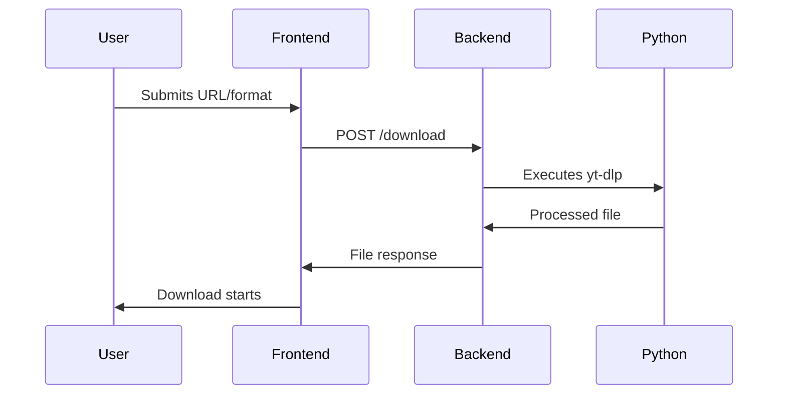
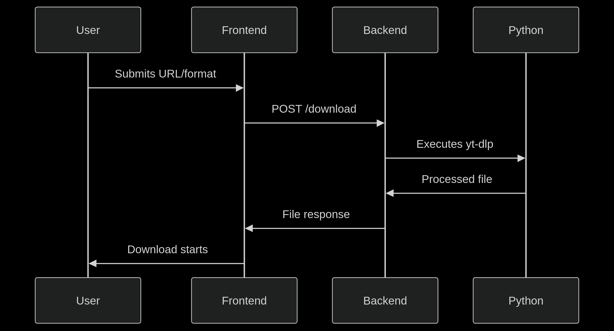

# Technical Documentation

## Overview

An online YT-DLP Interface featuring:

- Java backend (Spring Boot + GraalVM Native Image)
- HTML/CSS/JS frontend
- Python media processing component

```plain
src/
├── main/
│   ├── java/              # Spring Boot code
│   ├── python/            # Download scripts
│   ├── resources/
│   │   ├── static/        # Assets (CSS, JS, images)
│   │   └── templates/     # HTML templates
│   └── docker/            # Docker configuration
├── test/                  # Tests
Makefile                   # Build automation
pom.xml                    # Maven configuration
```

## Prerequisites

- Java 21
- Maven
- Python 3.10+
- GraalVM (for native build)

## Installation

To install and run locally:

```bash
git clone https://github.com/seu-usuario/videodownloader.git
cd videodownloader

make
```

## Execution

The generated executable is in the docker folder:

```bash
./docker/videodownloader
```

The interface is accessible at `http://localhost:8080`.

## Testing

Automated test suite included:

```bash
# Run all tests:
make test
```

Tests verify:

- YouTube URL validation
- MP3/MP4 format processing
- Download resource generation
- Python component integration

## Key Components

### Backend (Java)

- `DownloadController`: Handles web requests
- `DownloadService`: Processes downloads
- URL and format validation

### Media Processing (Python)

- `ytdlp.py`: Core script
- Features:
  - Video downloading
  - MP3 conversion
  - Metadata extraction

### Frontend

- Responsive interface
- Video preview
- Download progress feedback

## Workflow



You can also see the process in the fluxogram:



## Configuration

Key settings in `application.properties`:

```properties
# Server port
server.port=8080

# Max upload size
spring.servlet.multipart.max-file-size=2GB
```

## License

[GNU GPLv3](LICENSE.txt) - Includes specific content download terms.

## Contribution

Contributions welcome! Follow these steps:

1. Fork project
2. Create branch (`git checkout -b feature/new-feature`)
3. Commit changes (`git commit -am 'Add new feature'`)
4. Push branch (`git push origin feature/new-feature`)
5. Open Pull Request
